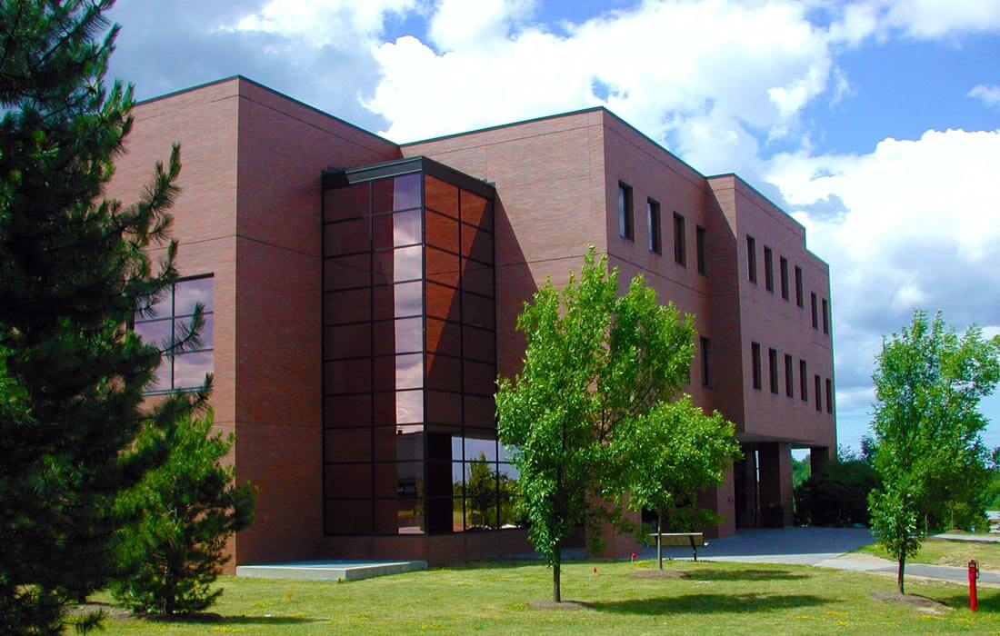
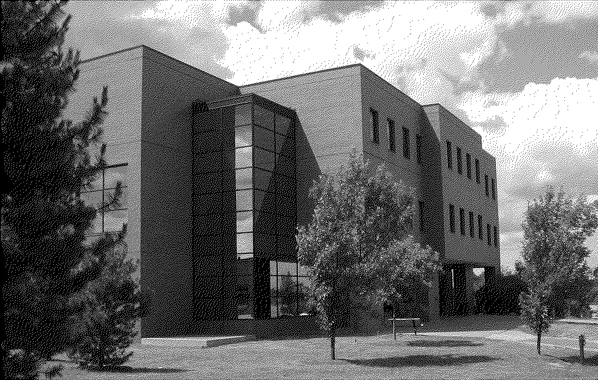
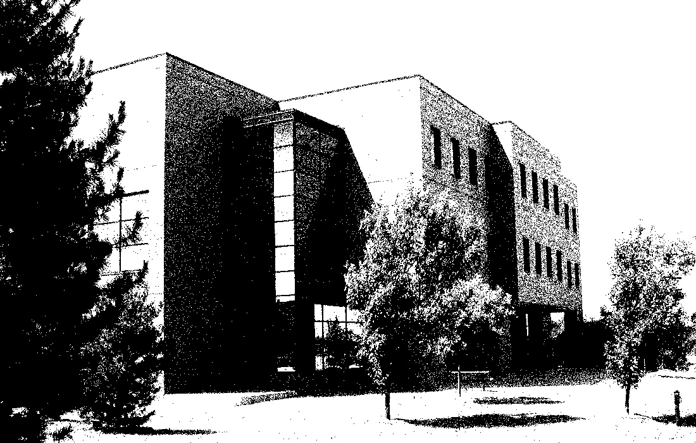
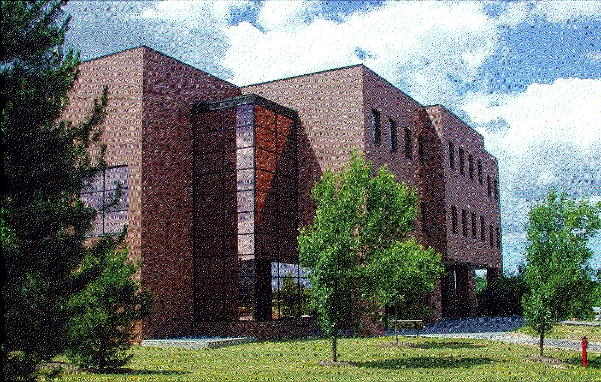

# Halftoning and Removal of Halftone
A python library with the implementation of Floyd-Steinberg Error Difussion and Blue Noise Dithering as well as Removal of Halftone using Fourier Masking

## Prerequisites
The primary requirements to run this library are:
- numpy (1.19.0 or higher)
- opencv-python (4.2.0.34 or higher)

Since we are using basic commands, it should not matter which version is installed. In case the library does not function as intended, there is a `requirements.txt` file which might be helpful.

# Available Functions
The Halftoniing library supports Floyd Steinberg Error Diffusion, Blue Noise Dithering and Removal of Halftone using Fourier Methods.

## Creating an object
The library object takes the following parameters:
```py
Halftoning(image, method = 'fs', debug = True):
```
image : the grayscale input image

method: the method that is to be applied to the image, methods can be __fs__ for Floyd-Steinberg Error Difussion, __blue__ for Blue Noise Dithering and __remove__ for Removal of Halftoning. By default, the method is __fs__.

debug: the deubg flag specifies whether to print error and debug messages. When __True__, it displays when certain processes are complete. By default, it is __False__.

## Running
After creating an object, we use the `run` method to run the function specified during object creation. The function definition is:
```py
halftone.run(resize=None)
```
The optional parameter `resize` is a 2-d tuple specifying the dimensions of the image on which to run the algorithm on. This allows user flexibility to observe effects of the same algorithmm for different size of image. By default, the resize is __None__, which means it will retain the dimension of the input image.

An example usage is:
```py
halftoning.run((600, 800))
```
## Displaying the result
The output image can be viewed on a new window with this method. 
```py
show(window_name = 'Output')
```
The optional argument `window_name` specifies the name of the window in which to display in. For example:
```py
show('Result')
```
## Saving the result
The output image can be saved as a file with this method.
```py
save(filename='output.jpg')
```
The optional parameter filename specifies the name of the output image to save. By default, the image is saved as `output.jpg`. Be sure to specify the file extension when supplying the filename. For example:
```py
save('result.png')
```
## Getting a copy of the output
If you want a copy of the output, use the `get_output` method.
```
get_output()
```
# Example Use
An example use is discussed below.

First, we import an image in grayscale via opencv.
```py
    filename = "image.jpg"
    image_bw = cv2.imread(filename, cv2.IMREAD_GRAYSCALE)
```
We then pass the image as an argument to the Halftoning library.
```py
    fs = Halftoning(image_bw)
```
We run the function and show it on a window
```py
    fs.run()
    fs.show()
```
If required, we can save the file
```py
    fs.save('fs'+filename)
```
The full code is below:
```python
import numpy as np
import cv2

from halftoning import Halftoning

def main():
    filename = "image.jpg"
    image_bw = cv2.imread(filename, cv2.IMREAD_GRAYSCALE)

    fs = Halftoning(image_bw)
    fs.run()
    fs.show()
    fs.save('fs'+filename)

    while(cv2.waitKey(0) != 27):
        continue
    cv2.destroyAllWindows()

if __name__=='__main__':
    main()
```
# Example Outputs
## Colored Image


## Floyd-Steinberg Error Diffused Image


## Blue Noise Dithered Image


# Beyond this library
While the library only natively supports grayscale images, we can easily manipulate to create beautiful halftoned images by first splitting the RGB channels, halftoning them separately and combining them back into one color image.
## Colored Floyd-Steinberg Error Diffused Image

